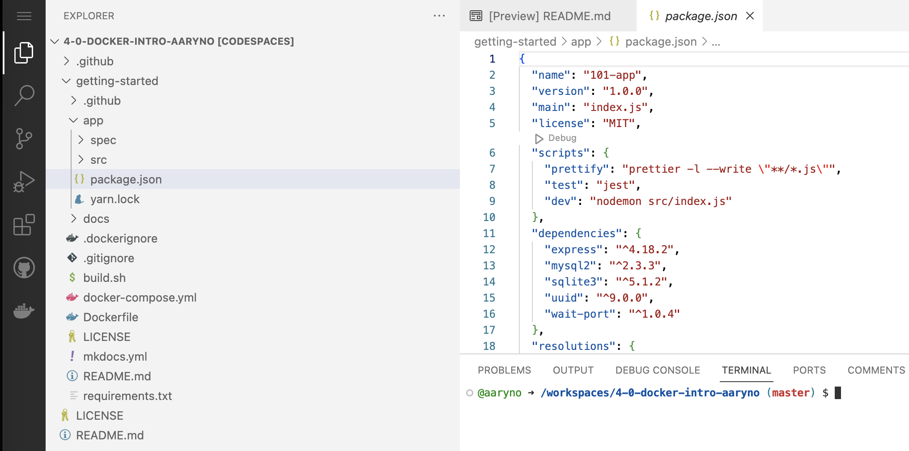
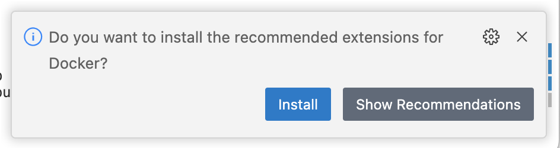
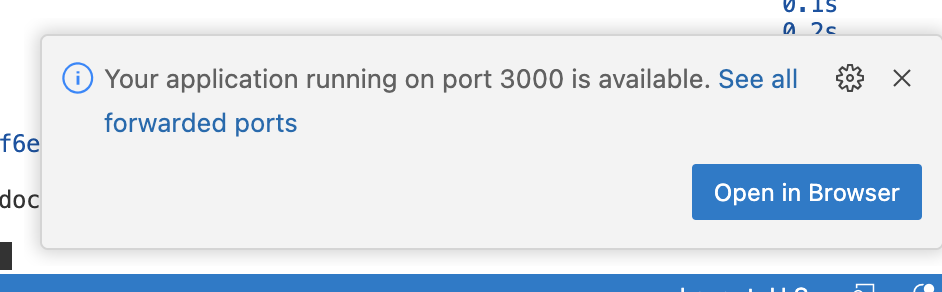

# Assignment: Introduction to Docker

## Deliverables
- branch named `docker` with pull request to merge with `master` containing the following:
  - edits to this `README.md` with answers to the questions denoted with `Q:`

## Background

For this assignment you will learn a little about Docker. Docker is a containerization platform designed to isolate and reduce tasks in a way that allows them to be run anytime, anywhere. This assignment follows an online tutorial that describes building and running docker containers in a local environment. However, since we are doing this in Codespaces, there are some important details that you should be aware of. In this sense, this assignment is giving you practice with docker AND codespaces.

### 1. Watch the following overview of what docker is and how it works: https://www.youtube.com/watch?v=YFl2mCHdv24

### 2. Read https://www.docker.com/resources/what-container

### 3. Follow an online tutorial. 
You will follow parts 1-5 of https://docs.docker.com/get-started/ and answer some questions. However...

This part is where some important details differ between the tutorial and codespaces that I wanted to share. So before you get into the tutorial, read some background:

As you know after watching the video and reading the document above, docker allows you to run an image on some client. When it's running it's called a container. The docker images tend to be small, self-contained, and have a single purpose. That is, no extra fluff. Unlike a laptop where you have all your applications installed, a docker image only has what it needs for that one purpose installed. So as long as you have a Docker Engine running, you can run the image. The tutorial assumes you are running docker on your own machine and there will occasionally be instructions that have tabs for `Linux/Mac` vs `Windows`. For running in codespace, you will use the `Terminal` window and follow the instructions for `Linux/Mac` which should be what is shown by default.

There are some specific parts of the tutorial that also need clarification or context.

#### General guidance
All commands should be entered in the `Terminal` window and you should follow the `Linux/Mac` or `CLI` option where there is a code block section in the tutorial.

All references in the tutorial to paths will be relative to the `getting-started` directory and need to be updated accordingly. 

#### In Part two - Get the App
- In step 1, where you clone the `getting-started` repo, enter that command in the `Terminal` window of your Codespace. In fact, all commands should be entered in the `Terminal` window.
- In step 2, the screenshot shows you what this would look like if you opened up the `getting-started` repo in VS Code. Your Codespace will actually look very similar but the `getting-started` repo will actually just look like another directory in your Explorer window:

#### In Part two - Build the app's container image,
- `cd /path/to/app` should be changed to `cd getting-started/app` (this applies elsewhere when you see `/path/to/app`)
- `touch Dockerfile` will create a file named `Dockerfile` that will appear in the `getting-started/app` directory in your `Explorer` window. 
- When you open Dockerfile, VSCode will prompt you to install a Docker extension. Install it.

#### In Part two - Start an app container
- Follow the `CLI` options for the commands. I will go over in class how to do the same things using the Docker extension in VSCode. 
- When you run the command `docker run -dp 3000:3000 getting-started`, you will get a VSCode dialog about port 3000. Click the button to open the browser.

#### In Part three - update the source code
- the path `src/static/js/app.js` refers to the path inside `getting-started`.

#### Do it!
With that out of the way, go ahead and read Parts 1-5 of https://docs.docker.com/get-started/. You can follow along and create your own docker container, which will be part of the assignment below.

## Assignment
Save your work files to a new branch named `solution` and submit a Pull Request to merge with `master` when you are finished but _do not merge_. 

Follow Parts 1-5 of the getting started tutorial at https://docs.docker.com/get-started/.

Answer the following questions in this document:

1) What is your docker username? Put it in the same line as `DOCKER_USER=` below (no markdown please) like `DOCKER_USER=your_username`:

DOCKER_USER= millers5

2) What is docker (your own words)?

A: Docker is an open platform that allows the user to reduce time between writing code for an application and executing the software application. It provides consistency throughout the creation process, the ability to work on multiple areas without chewing up large swaths of space and can be used freely by anyone. It allows for simplicity by using the same environments, separating projects, and the ability to start up wherever someone else left off.

3) What is a docker container?

A:  A container is a runnable image. It can be easily controlled by the user and can be accessible on multiple networks. Containers are run by an image.

4) What is a docker image?

A: Docker image is a read only file that has all the code, operating systems, libraries, and various features that make up the container that will be run.

5) What is a docker volume?

A: Volumes can act as a local directory. They can store files for running containers. This allows for changes to be made and those changes can be treated as separate files. The user has the ability to store volumes outside of the lifecycle of the container.

6) In a Dockerfile, what does `FROM` mean?

A: FROM is a command to call up any valid base docker image. The container will start from this image.

7) In a Dockerfile, what does `EXPOSE` mean?

A: EXPOSE is a command that tells the container to listen on a specified port. 

8) What is port-forwarding?

A: A technique that allows computers or networks to connect with other public or private networks via the internet. This allows remote users access to local files.

9) What is a docker tag?

A: A tag is a marker that gives an image its name. It can tag existing images to ones the user has built or modified.

10) What is a docker layer?

A: A base image. Then whenever something else is installed or added, a layer is created. they continue to build on top of each other, like an onion.

11) What is the difference between a docker tag and docker container id?

A: A docker tag can be applied to the image and the tag/name is chosen and created by the individual user, while a container id is a specific id code containing 64 randomly generated letters and numbers. A container id code cannot be modified, while a tag can

12) What is the difference between a docker hub, repository, and image?

A: Images are hosted on repositories. Images contain all the different layers. Repositories are hosted on docker hub. Repositories can have lots of different images or files attached to them. The docker hub allows access to all of the repositories. An example is that an Image is like a paper, in a Repository or "file" and the files are in a hub or "file cabinet".

13) What is detached mode?

A: "-d" It means that the operation will run in the background of the terminal. Without detaching the terminal will lock up until the process is finished.

14) What is the name of the docker container you created in the tutorial? It should be something like `<your_username>/get-started:part2)` where `<your_username>` is your username. If you have tagged and published (`push`ed) the docker container you created in Part 2, then I will be able to `pull` your container and `run` it on my own machine.

A: millers5/getting-started

### Turn in your work via GitHub Pull Request. 

Open a *Pull request* to merge your assignment files with the `master` branch. Do not Merge.
